# OMP Provider Phase 1: Oh My Pi ACP Driver

## Goal

Add **Oh My Pi (OMP)** as a first-class provider (`driverKind = "omp"`) so T3 Code can drive OMP the same way it drives Codex/Claude/Cursor/Grok/OpenCode. OMP already ships an Agent Client Protocol (ACP) agent (`omp acp`); this phase implements the T3 Code side — a driver + adapter + snapshot probe + text-generation service — reusing the existing ACP runtime the Grok and Cursor providers are built on.

When this phase lands, a user configures OMP in Settings, opens a thread against it, and gets the full multi-thread / worktree / checkpoint / diff / one-click-PR workflow — with **zero UI changes** — because the client is driven entirely by `ProviderRuntimeEvent`.

This is an **implementation spec for agents**, structured for parallel execution. It assumes the reader has NOT investigated OMP; every non-obvious decision is pre-resolved below. Do not re-derive them.

## Verified facts (do not re-investigate)

These were established empirically before writing this spec. Trust them.

1. **Protocol is ACP v1 and wire-compatible.** A spec-conformant client drove the installed `omp acp` (v17.3.7) through `initialize → session/new → session/prompt` with streamed `session/update` notifications and a clean `end_turn`. Auth via existing `~/.omp` credentials works with **no separate login flow** on the happy path.
   - OMP `initialize` returns `protocolVersion: 1`, `agentInfo {name: "oh-my-pi", title: "Oh My Pi"}`, `authMethods: ["agent"]`, and `agentCapabilities` = `{loadSession, sessionCapabilities{list,fork,resume,close}, promptCapabilities{embeddedContext,image}, mcpCapabilities{http,sse}}`.
   - OMP `session/new` returns `modes` = `["default","plan"]` plus `configOptions`.
2. **Model / mode / thinking are surfaced via ACP `configOptions`, NOT the `models` field.** This is the ONE real delta versus the Grok template. OMP source: `#buildConfigOptions` at `~/Work/github/oh-my-pi/packages/coding-agent/src/modes/acp/acp-agent.ts:1545`. Config option ids: `mode` (category `"mode"`), `model` (category `"model"`), `thinking` (category `"thought_level"`). Set them via `session/set_config_option`.
3. **`effect-acp` fully supports that surface.** `packages/effect-acp/src/client.ts:117` exposes `setSessionConfigOption`; `SessionConfigOptionCategory = "mode" | "model" | "thought_level"` (`packages/effect-acp/src/_generated/schema.gen.ts:487`); NewSession/Load/Resume responses carry `configOptions` (`schema.gen.ts:3520`), and a `config_option_update` session-update exists. No escape hatch needed.
4. **`ProviderDriverKind` is an open branded slug** (`packages/contracts/src/providerInstance.ts:70`). Adding `"omp"` needs no closed-union edit; the registration surface is the per-provider *maps* in `contracts` (settings + model) plus `BUILT_IN_DRIVERS`.
5. **The reference provider to mirror is Grok** (leanest pure-ACP provider). Cursor is a secondary reference. Copy their structure; deviate only where this spec says so.

## Scope

Add files under `apps/server/src/provider/`, `apps/server/src/textGeneration/`, and register in `packages/contracts/`.

New files:
- `apps/server/src/provider/Drivers/OmpDriver.ts`
- `apps/server/src/provider/acp/OmpAcpSupport.ts`
- `apps/server/src/provider/acp/OmpAcpCliProbe.ts`
- `apps/server/src/provider/Layers/OmpAdapter.ts`
- `apps/server/src/provider/Layers/OmpProvider.ts`
- `apps/server/src/provider/Services/OmpAdapter.ts`
- `apps/server/src/textGeneration/OmpTextGeneration.ts`
- Test files mirroring the Grok test set (see Testing).

Modified files:
- `apps/server/src/provider/builtInDrivers.ts` — register `OmpDriver` + env.
- `packages/contracts/src/settings.ts` — add `OmpSettings`, `OmpSettingsPatch`, and map entries.
- `packages/contracts/src/model.ts` — add `OMP_DRIVER_KIND` + entries in the per-provider maps.

## Non-Goals

- **No UI changes.** No edits to `apps/web`, `apps/mobile`, `apps/desktop`, or `packages/client-runtime`. If a task thinks it needs one, stop and escalate — it almost certainly does not.
- **No changes to core orchestration or the provider SPI** (`ProviderDriver.ts`, `Services/ProviderAdapter.ts`, `orchestration/*`, `Services/ProviderService.ts`). The driver plugs into the existing contracts unchanged.
- **No surfacing of OMP's internal agent-hub / subagent roster as bespoke UI.** OMP subagents inside a turn render as ordinary tool activity via `ProviderRuntimeEvent`. Nested-orchestration UI is explicitly out of scope.
- **No upstream contribution / PR.** Fork-only. Do not open a PR unless the developer explicitly asks.
- **No shims or aliases.** Clean cutover conventions apply; there is nothing to migrate here, so there is nothing to shim.

## Integration contract (what every workstream builds against)

`OmpDriver.create()` returns a `ProviderInstance` (`apps/server/src/provider/ProviderDriver.ts:64`) bundling three closures owned by the instance scope:
- `snapshot: ServerProviderShape` — status/auth/model catalog probe → built by **OmpProvider**.
- `adapter: ProviderAdapterShape<ProviderAdapterError>` — session/turn lifecycle + `streamEvents` → built by **OmpAdapter**.
- `textGeneration: TextGeneration.Service` — commit/PR/branch/title generation → built by **OmpTextGeneration**.

`ProviderAdapterShape<TError>` (the full method set the adapter MUST implement) is at `apps/server/src/provider/Services/ProviderAdapter.ts:45`: `startSession`, `sendTurn`, `interruptTurn`, `respondToRequest`, `respondToUserInput`, `stopSession`, `listSessions`, `hasSession`, `readThread`, `rollbackThread`, `stopAll`, `streamEvents`, plus `provider` and `capabilities`.

Shared ACP infrastructure to REUSE (do not reimplement):
- `apps/server/src/provider/acp/AcpSessionRuntime.ts` — spawn, connection, session lifecycle.
- `apps/server/src/provider/acp/AcpCoreRuntimeEvents.ts` — `makeAcp*Event` constructors that produce `ProviderRuntimeEvent`s from ACP session updates.
- `apps/server/src/provider/acp/AcpAdapterSupport.ts` — `mapAcpToAdapterError`, `acpPermissionOutcome`.
- `apps/server/src/provider/acp/AcpRuntimeModel.ts` — `parsePermissionRequest`.
- `packages/effect-acp` — the ACP client, schema, errors.

### The model-mapping delta (the one thing that differs from Grok)

Grok reads the current model from `sessionSetupResult.models?.currentModelId` and sets it via `session/set_model` (`GrokAcpSupport.ts:85` `currentGrokModelIdFromSessionSetup`). **OMP does not populate `models`.** For OMP:
- **Read** the current model from `configOptions`: find the option with `category === "model"` (id `"model"`), read its `currentValue`; its selectable values enumerate the model catalog.
- **Set** the model via `client.setSessionConfigOption({ sessionId, configId: "model", value })`.
- Same pattern for thinking level (`configId: "thinking"`, category `"thought_level"`) and mode (`configId: "mode"` / or `session/set_mode`).

`OmpAcpSupport` MUST expose helpers that encapsulate this so the adapter, provider, and text-generation code never touch raw config-option plumbing.

## File manifest

| File | Mirror of | Purpose | ~LOC |
|---|---|---|---|
| `contracts/src/settings.ts` (edit) | `GrokSettings` @ `settings.ts:445` | `OmpSettings` + `OmpSettingsPatch` + map entries `providers.omp` | +60 |
| `contracts/src/model.ts` (edit) | `GROK_DRIVER_KIND` @ `model.ts:133` | `OMP_DRIVER_KIND` + per-provider default/display map entries | +15 |
| `provider/acp/OmpAcpSupport.ts` | `acp/GrokAcpSupport.ts` (108) | spawn input (`["acp"]`), auth `"agent"`, `makeOmpAcpRuntime`, **config-option model/mode/thinking helpers** | ~140 |
| `provider/acp/OmpAcpCliProbe.ts` | `acp/GrokAcpCliProbe.ts` | binary presence + `omp --version` probe for snapshot status | ~90 |
| `provider/Services/OmpAdapter.ts` | `Services/GrokAdapter.ts` (16) | `OmpAdapterShape extends ProviderAdapterShape<ProviderAdapterError>` | ~16 |
| `provider/Layers/OmpAdapter.ts` | `Layers/GrokAdapter.ts` (1470) | ACP↔`ProviderRuntimeEvent` mapping, session/turn lifecycle, approvals, rollback | ~800–1100 |
| `provider/Layers/OmpProvider.ts` | `Layers/GrokProvider.ts` (335) | snapshot: status probe, auth (`~/.omp`) detection, model catalog from config options | ~300 |
| `textGeneration/OmpTextGeneration.ts` | `textGeneration/GrokTextGeneration.ts` (260) | commit/PR/branch/title via OMP ACP runtime | ~260 |
| `provider/Drivers/OmpDriver.ts` | `Drivers/GrokDriver.ts` (163) | driver value: kind, metadata, `configSchema=OmpSettings`, `defaultConfig`, `create()` bundling the three closures | ~180 |
| `provider/builtInDrivers.ts` (edit) | existing array | import + add `OmpDriver` and `OmpDriverEnv` | +4 |

Expected new/modified impl LOC ≈ 1,600–2,100; tests ≈ 900–1,400.

## Parallelization plan

Three phases. The barrier between phases is a hard sync point — do not start a later phase until the earlier phase's acceptance gate is green. Within a phase, agents run concurrently and MUST NOT block on each other (skip validation mid-flight per Guardrails).

```mermaid
graph TD
  P1[Phase 1 - Foundation - serial]
  A2[WS-A OmpAdapter]
  B2[WS-B OmpProvider + CliProbe]
  C2[WS-C OmpTextGeneration]
  P3[Phase 3 - Integration - serial]
  P1 --> A2
  P1 --> B2
  P1 --> C2
  A2 --> P3
  B2 --> P3
  C2 --> P3
```

### Phase 1 — Foundation (serial, ONE agent) — barrier

Everything downstream imports these symbols, so they must exist and typecheck first.

- **WS-0 (contracts + shared ACP seam).** Model/effort: **Medium**.
  1. `contracts/src/model.ts`: add `const OMP_DRIVER_KIND = ProviderDriverKind.make("omp")`; add entries to `DEFAULT_MODEL_BY_PROVIDER`, `DEFAULT_TEXT_GENERATION_MODEL_BY_PROVIDER`, `PROVIDER_DISPLAY_NAMES` (`"Oh My Pi"`), and `MODEL_SLUG_ALIASES_BY_PROVIDER` if needed. For the default model slug, resolve OMP's canonical default (inspect OMP's model registry or run `omp` help; if unresolved, use the model reported in `configOptions.currentValue` at first session and set the map to that literal — do NOT invent a slug).
  2. `contracts/src/settings.ts`: add `OmpSettings = makeProviderSettingsSchema({...})` mirroring `GrokSettings:445` with `binaryPath` default `"omp"` and `customModels`. **Default `enabled: true`** (OMP is this fork's flagship; Grok/Cursor default false because they are opt-in). Add `omp: OmpSettings.pipe(Schema.withDecodingDefault(...))` to the `providers` struct (near `settings.ts:663`). Add `OmpSettingsPatch` (near `798`) and register it in the patch struct (near `851`).
  3. `provider/acp/OmpAcpSupport.ts`: implement and FREEZE its exported signatures (this is the interface the whole of Phase 2 codes against). Required exports:
     - `buildOmpAcpSpawnInput(settings, cwd, env?) => AcpSpawnInput` (argv `["acp"]`).
     - `makeOmpAcpRuntime(input) => Effect<AcpSessionRuntime["Service"], AcpError, Crypto | Scope>`.
     - `currentOmpModelIdFromSessionSetup(sessionSetupResult) => string | undefined` — reads from `configOptions` (category `"model"`).
     - `applyOmpModelSelection({ client, sessionId, model }) => Effect<string | undefined, E>` — via `setSessionConfigOption({configId:"model", value})`.
     - `ompModelCatalogFromSessionSetup(sessionSetupResult) => ReadonlyArray<{id,name}>` — the selectable model option values.
     - `OMP_AUTH_METHOD = "agent"` and an auth-method resolver.
  4. `provider/Services/OmpAdapter.ts`: the one-line shape interface.

**Phase 1 gate:** `vp typecheck` (targeted: contracts + the two new files) is clean; `OmpAcpSupport` exports are committed and will not change shape. Publish the frozen `OmpAcpSupport` signature list to Phase 2 agents in the batch context.

### Phase 2 — Provider internals (parallel, THREE agents)

All three import `OmpAcpSupport` (frozen) + shared ACP infra. They touch disjoint files; overlap only through the frozen interface. Each skips validation until its own file typechecks in isolation.

- **WS-A — `Layers/OmpAdapter.ts`.** Model/effort: **High (frontier model, max reasoning).** This is the hardest file: heavy Effect (`PubSub`, `Stream`, `Ref`, `Scope`, `Semaphore`), and the full ACP→`ProviderRuntimeEvent` mapping. Mirror `Layers/GrokAdapter.ts` closely but **remove all XAi/`XAiAcpExtension` specifics** (OMP is vanilla ACP — no ask-user extension, no OAuth referrer). Implement every `ProviderAdapterShape` method. Use `AcpCoreRuntimeEvents` constructors for event mapping, `mapAcpToAdapterError`/`acpPermissionOutcome` from `AcpAdapterSupport`, `parsePermissionRequest` from `AcpRuntimeModel`. Model changes on a live session go through `applyOmpModelSelection`; set `capabilities.sessionModelSwitch = "in-session"`. Map `session/fork` and `session/resume` (both advertised by OMP) to `rollbackThread`/session continuation.
- **WS-B — `Layers/OmpProvider.ts` + `acp/OmpAcpCliProbe.ts`.** Model/effort: **Medium.** Mirror `Layers/GrokProvider.ts` + `acp/GrokAcpCliProbe.ts`. Implement `buildInitialOmpProviderSnapshot`, `checkOmpProviderStatus` (binary presence via `binaryPath`/`omp --version`, auth detection by presence of `~/.omp` credential state — cheap; no network), `enrichOmpSnapshot` (model catalog via `ompModelCatalogFromSessionSetup`). Keep the probe fast: default status refresh must be local-only.
- **WS-C — `textGeneration/OmpTextGeneration.ts`.** Model/effort: **Medium.** Mirror `textGeneration/GrokTextGeneration.ts`. Implement `makeOmpTextGeneration` returning the `TextGeneration.Service` (`generateCommitMessage`, `generatePrContent`, `generateBranchName`, `generateThreadTitle`) by running structured-JSON prompts through `makeOmpAcpRuntime`, selecting the text-gen model via `applyOmpModelSelection`. Reuse `TextGenerationPrompts` and `TextGenerationUtils`.

**Phase 2 gate:** each new `Layers/*`/`textGeneration/*` file typechecks against the frozen support module. Do NOT run the full suite here.

### Phase 3 — Integration + registration (serial, ONE agent)

- **WS-D.** Model/effort: **Medium.**
  1. `provider/Drivers/OmpDriver.ts`: mirror `Drivers/GrokDriver.ts`. Wire `configSchema = OmpSettings`, `defaultConfig`, `metadata {displayName: "Oh My Pi", supportsMultipleInstances: true}`, and `create()` that opens the process scope and bundles `snapshot` (WS-B), `adapter` (WS-A), `textGeneration` (WS-C) via `makeManagedServerProvider`. Declare `OmpDriverEnv` (union of the infra services the three closures need — copy Grok's env union; adjust).
  2. `provider/builtInDrivers.ts`: import `OmpDriver` + `OmpDriverEnv`, add `OmpDriverEnv` to `BuiltInDriversEnv`, add `OmpDriver` to `BUILT_IN_DRIVERS`.
  3. Reconcile any drift between the three Phase-2 closures and the `ProviderInstance` bundle.

**Phase 3 gate:** targeted `vp typecheck` + `vp lint` on all changed scope clean; unit tests (below) pass; the live ACP smoke passes.

## Testing

Mirror the Grok test set. Deterministic, no sleeps (the server is event-sourced — await receipts/drains, per AGENTS.md). Do not run repo-wide suites.

- `Layers/OmpAdapter.test.ts` (mirror `GrokAdapter.test.ts`): drive a **mock ACP peer** (see `packages/effect-acp/test/fixtures/acp-mock-peer.ts`) and assert `ProviderRuntimeEvent` output for: session start, assistant deltas, tool-call, permission request→decision round-trip, model switch via config option, interrupt, rollback, session-closed error mapping.
- `Layers/OmpProvider.test.ts` (mirror `GrokProvider.test.ts`): status ready/warning/error; missing binary; auth-absent; model-catalog enrichment.
- `acp/OmpAcpSupport.test.ts` + `acp/OmpAcpCliProbe.test.ts`: spawn-input argv, auth resolver, `currentOmpModelIdFromSessionSetup` reads from `configOptions`, `applyOmpModelSelection` issues `set_config_option`, probe parses `--version`.
- `contracts settings.test.ts` additions: `OmpSettings` round-trips; `defaultEnabledForDriver("omp")` is `true`; patch schema accepts `omp`.
- **Live ACP integration smoke** (gate behind an env flag / skip if `omp` not on `PATH`, mirroring `CodexCollabRuntime.integration.test.ts`): spawn real `omp acp`, run `initialize → session/new → session/prompt("Reply with exactly: PONG")`, assert `stopReason: "end_turn"` and that a `config_option_update`/`agent_message_chunk` was observed. This reproduces the manual smoke that de-risked the protocol.

Follow-up probes worth adding but not gating this phase: a turn that forces a real tool call to exercise the permission callback end-to-end; `session/fork` + `session/resume` mapped to a T3 Code checkpoint restore.

## Acceptance criteria

- A user can configure an `omp` provider instance in Settings and start a thread against it; prompts stream assistant output, tool calls, and reach a normal end-of-turn.
- Model, mode, and thinking-level selection work through OMP's `configOptions` (verified by test asserting `set_config_option` is issued, not `set_model`).
- Permission/approval requests round-trip; interrupt and rollback work.
- One-click commit/PR/branch/title generation works via `OmpTextGeneration`.
- Snapshot reports `ready` when `omp` is installed + authed, and a clear `error`/`warning` otherwise; background status refresh is local-only.
- **No files changed under `apps/web`, `apps/mobile`, `apps/desktop`, `packages/client-runtime`, or the provider SPI/orchestration core.**
- `ProviderDriverKind` `"omp"` round-trips through settings without loss; unknown-driver handling is untouched.
- Live ACP integration smoke passes against a real `omp` binary.
- Targeted `vp typecheck`, `vp lint`, and `vp test run <changed files>` pass for the changed scope. (CI owns the full suite — do not run repo-wide checks.)

## Guardrails for executing agents (from AGENTS.md)

- **Read `.repos/effect-smol/LLMS.md` before writing any Effect code.** This codebase is Effect-native; inferred types over annotations; `any` is forbidden.
- **Never run repo-wide checks** (`vp check`, `vp run -r test|typecheck`). Only targeted `vp test run <files>`, `vp lint`, `vp typecheck` for your scope. Mid-phase, skip validation entirely so parallel agents don't block each other; validate at the phase gate.
- **Subagents must not launch dev servers** (`vp run dev`) and must not perform browser/computer-use. The primary agent does any single integrated client pass, and only on explicit request.
- **Never touch the live install** `~/.t3/userdata`; never kill processes by name/pattern.
- **No PR** unless the developer explicitly asks. Conventional-commit titles if/when asked; end the body with the model + harness that did the work.
- Complexity belongs at the adapter boundary; orchestration stays pure; UI stays dumb. If a rule here fights the task, stop and get sign-off rather than breaking it silently.

## Suggested agent batch (Phase 2)

Dispatch as one `tasks[]` batch after the Phase 1 gate is green. Shared `context` MUST include the frozen `OmpAcpSupport` export signatures and this file's path.

- `OmpAdapterImpl` — WS-A — **frontier model, high reasoning.**
- `OmpProviderImpl` — WS-B — **mid model, medium reasoning.**
- `OmpTextGenImpl` — WS-C — **mid model, medium reasoning.**

Phase 1 (WS-0) and Phase 3 (WS-D) each run as a single mid-reasoning agent; contracts/registration boilerplate within them (map entries, the 4-line `builtInDrivers` edit, the one-line Services shape) may be delegated to a low/mechanical fast model.
